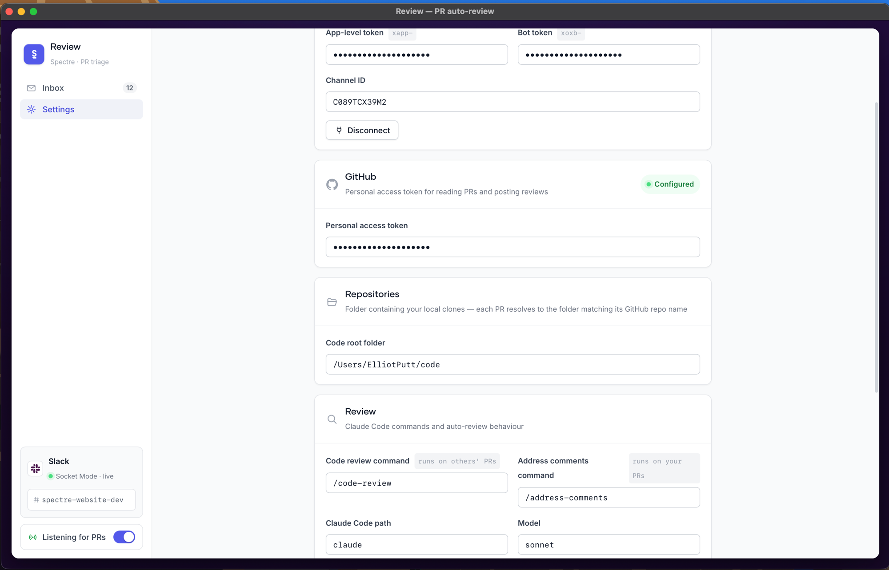
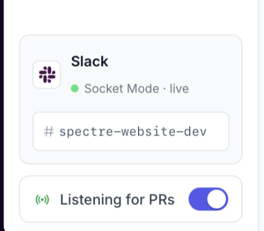
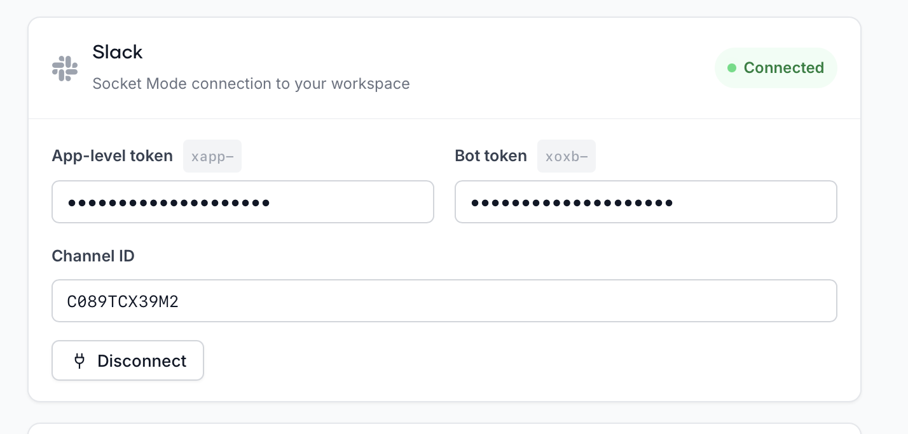

# PR Reviewer

A macOS desktop app that watches a Slack channel for GitHub PR links, auto-runs **Claude Code reviews** in an embedded terminal, and lets you approve or post the review — without leaving the app.



## What it does

1. Listens to your team's dev channel (Slack Socket Mode) for GitHub PR links — **any repo**.
2. When a PR lands: fetches its metadata, sends a Mac notification, and (with auto-review on) immediately spawns `claude` in a background terminal running `/code-review <pr-url>` inside an isolated git worktree of that repo.
3. When the review is ready you get another notification — click it, the app opens on that PR with the full review already in the terminal. Chat with Claude about it if you like.
4. Click **Approve** or **Mark as reviewed** — posts to GitHub and cleans up the session.

For **your own PRs**, a background poller watches for new unresolved review comments and flags them "Needs Attention" with an **Address Comments** button that runs `/address-comments`.

<p align="center"></p>

## Requirements

- macOS
- [uv](https://docs.astral.sh/uv/) (`brew install uv`)
- [Claude Code](https://claude.com/claude-code) CLI, logged in (`claude` on your PATH)
- `terminal-notifier` for Mac notifications (`brew install terminal-notifier`)
- Local clones of the repos you review, all in one folder (e.g. `~/code/<repo-name>` — folder names must match the GitHub repo names exactly)

## Install (Mac app — recommended)

1. Download the latest `PR-Reviewer-x.y.z.dmg` from [Releases](https://github.com/Elliot-putt/pr-reviewer/releases).
2. Open it and drag **PR Reviewer** into **Applications**, then launch it from Launchpad / Spotlight and pin it to your Dock.
3. First launch only: the app is unsigned, so macOS will block it with *"Apple could not verify…"*. Click **Done** (not Move to Bin), then open **System Settings → Privacy & Security**, scroll down to *"PR Reviewer" was blocked…* and click **Open Anyway**. (Terminal alternative: `xattr -dc "/Applications/PR Reviewer.app"`.) This is a one-time step per machine.

The app stores its config in `~/Library/Application Support/PR Reviewer/.env` — use the in-app Settings page to fill everything in. You still need the [Requirements](#requirements) below installed (`claude`, `terminal-notifier`, local clones).

## Run from source (alternative)

```bash
git clone https://github.com/Elliot-putt/pr-reviewer.git
cd pr-reviewer
cp .env.example .env   # optional — the in-app Settings page can fill everything in
uv run main.py
```

Open **Settings** in the app and fill in the fields below. Everything saves to `.env` and applies live — no restart needed.

### Slack app setup

You need a Slack app with **Socket Mode**. One app can be shared by the whole team (each person uses the same tokens):

1. Create an app at [api.slack.com/apps](https://api.slack.com/apps) → **From scratch**.
2. **Socket Mode** → enable → create an app-level token with `connections:write` → that's your `xapp-` token.
3. **OAuth & Permissions** → Bot Token Scopes: `channels:history`, `channels:read` — and for **private channels** also `groups:history`, `groups:read` → **Install to Workspace** → that's your `xoxb-` token.
4. **Event Subscriptions** → enable → Subscribe to bot events → add `message.channels` — and for **private channels** also `message.groups` → **Save Changes** (easy to forget — no events arrive without it).
5. Invite the bot to your dev channel: `/invite @YourApp`.

> **Note:** any time you add scopes or events later, you must reinstall the app to the workspace — that issues a *new* bot token, so update it in Settings.



In the app's Settings, paste both tokens, then pick the channel from the searchable dropdown and hit **Connect**.

### GitHub

A classic personal access token with `repo` scope. Used to read PR metadata, post reviews/approvals, and poll your own PRs for comments.

### Review skills

Reviews run whatever slash-command skill you configure (default `/code-review`). If the PR's repo doesn't have the skill in `.claude/skills/`, the app falls back to the skill in your `SKILLS_REPO` — so only one repo needs to host it.

## Everyday use

- **To Review** tab: teammates' PRs. With auto-review on, they arrive already reviewed — read, then Approve / Mark as reviewed.
- **Needs Attention** tab: your PRs with unresolved comments — hit Address Comments and Claude fixes them in a worktree.
- Sessions are killed automatically 20 minutes after the terminal goes quiet (countdown shown in the footer) — configurable via **Idle timeout** in Settings.
- The **Listening for PRs** toggle pauses intake without disconnecting Slack.

## Updating

The app checks GitHub releases on launch (and every 6 hours). When a newer version exists you'll see a banner linking to the release:

- **Mac app**: download the new DMG and drag it into Applications again (your settings live in Application Support and survive).
- **From source**: `git pull && uv run main.py`.

## Contributing / releasing

- Branch off `main`, open a PR, merge when green.
- To ship a release: bump `__version__` in `src/prreviewer/version.py` in your PR. On merge to `main`, GitHub Actions automatically tags `v<version>`, publishes a release with generated notes, and builds + attaches the Mac app (DMG and zip, Apple Silicon). Everyone's app picks it up via the update banner.
- No version bump → merge publishes nothing (safe for docs/refactor PRs).
